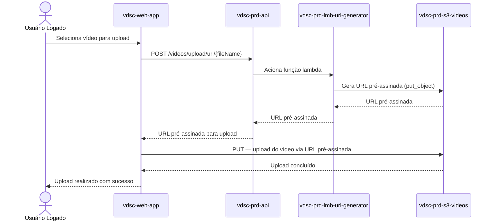
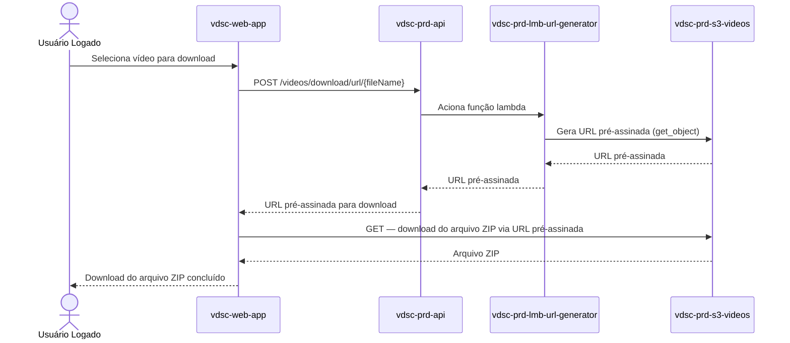

# MS Video URL Generator

[](https://github.com/11soat-hackathon-videoslice/ms-url-generator/actions/workflows/build_test_deploy_lambda.yaml)
[](https://sonarcloud.io/summary/new_code?id=11soat-hackton-videoslice_ms-video-url-generator)

Microserviço AWS Lambda para geração de URLs pré-assinadas para upload e download de vídeos.

## 📋 Visão Geral

O **ms-video-url-generator** é um microserviço serverless implementado como AWS Lambda Function que gera URLs pré-assinadas do Amazon S3. Este serviço permite que clientes façam upload de vídeos originais e download de vídeos processados de forma segura e temporária, sem necessidade de credenciais AWS diretas.

### Funcionalidades

- **Geração de URL para Upload**: Cria URLs pré-assinadas para upload de vídeos originais para o bucket S3
- **Geração de URL para Download**: Cria URLs pré-assinadas para download de vídeos processados do bucket S3
- **Validação de Requisições**: Valida parâmetros de entrada (nome do arquivo e tipo de ação)
- **Configuração de Expiração**: URLs pré-assinadas com tempo de expiração configurável
- **Suporte CORS**: Headers CORS configurados para integração com frontend

## 🏗️ Arquitetura

O microserviço segue os princípios da **Clean Architecture**, utilizando a biblioteca core [video-slice-core](https://github.com/11soat-hackathon-videoslice/video-slice-core) para implementação das camadas de domínio e aplicação.

### Diagramas de Sequência

#### Upload de Arquivo



#### Download de Arquivo




### Fluxo de Execução

1. **API Gateway** recebe requisição HTTP (POST)
2. **Lambda Handler** processa o evento e extrai parâmetros
3. **Controller** (da biblioteca core) orquestra a geração da URL
4. **Gateway S3** gera a URL pré-assinada
5. **Response** retorna URL pré-assinada com headers CORS


## 🚀 Tecnologias

- **Python 3.12**: Linguagem de programação
- **AWS Lambda**: Plataforma serverless
- **AWS S3**: Armazenamento de vídeos
- **API Gateway**: Endpoint REST
- **Boto3**: SDK AWS para Python
- **video-slice-core**: Biblioteca core com domínio e casos de uso

## 📦 Dependências

### Dependências de Produção
- `boto3`: SDK AWS para Python
- `vdsc-core`: Biblioteca core com lógica de negócio

### Dependências de Desenvolvimento
- `pytest`: Framework de testes
- `pytest-cov`: Cobertura de testes
- `pytest-mock`: Mock para testes
- `moto`: Mock de serviços AWS

## 🔧 Configuração

### Variáveis de Ambiente

A Lambda Function requer as seguintes variáveis de ambiente:

| Variável | Descrição | Exemplo |
|----------|-----------|---------|
| `S3_BUCKET_NAME` | Nome do bucket S3 | `video-slice-bucket` |
| `S3_BUCKET_DIR_UPLOADS` | Diretório de uploads | `uploads/` |
| `S3_BUCKET_DIR_FINISHED` | Diretório de vídeos processados | `finished/` |
| `S3_URL_DOWNLOAD_EXPIRATION` | Tempo de expiração do download (segundos) | `3600` |
| `S3_URL_UPLOAD_EXPIRATION` | Tempo de expiração do upload (segundos) | `3600` |

**Nota**: As variáveis `AWS_REGION` e `PYTHON_VERSION` são configuradas automaticamente pela AWS e não devem ser incluídas na configuração da Lambda.

## 🔌 API

### Endpoints

#### Upload URL
```
POST /video/upload/url/{fileName}
```

**Descrição**: Gera URL pré-assinada para upload de vídeo

**Parâmetros de Caminho**:
- `fileName`: Nome do arquivo a ser enviado (exemplo: `EfLoALwUlmei.mp4`)

**Resposta de Sucesso (200)**:
```json
{
    "url": "https://vdsc-prd-s3-videos.s3.amazonaws.com/uploads/EfLoALwUlmei.mp4?X-Amz-Algorithm=AWS4-HMAC-SHA256&X-Amz-Credential=...",
    "FileName": "EfLoALwUlmei.mp4",
    "expiresIn": 900,
    "s3Key": "uploads/EfLoALwUlmei.mp4",
    "action": "upload",
    "method": "put_object"
}
```

#### Download URL
```
POST /video/download/url/{fileName}
```

**Descrição**: Gera URL pré-assinada para download de vídeo processado

**Parâmetros de Caminho**:
- `fileName`: Nome do arquivo a ser baixado (exemplo: `EfLoALwUlmei.mp4`)

**Resposta de Sucesso (200)**:
```json
{
    "url": "https://vdsc-prd-s3-videos.s3.amazonaws.com/uploads/EfLoALwUlmei.mp4?X-Amz-Algorithm=AWS4-HMAC-SHA256&X-Amz-Credential=...",
    "FileName": "EfLoALwUlmei.mp4",
    "expiresIn": 120,
    "s3Key": "uploads/EfLoALwUlmei.mp4",
    "action": "download",
    "method": "get_object"
}
```

#### Resposta de Erro (500)
```json
{
  "error": "Mensagem de erro detalhada"
}
```

## 🧪 Testes

### Executar Testes Unitários

```bash
cd "C:\Users\A0157633\dev\java\f5\ms-video-url-generator"
pytest tests/ --cov=src --cov-report=xml:coverage.xml --cov-report=html --cov-report=term --junitxml=test-results.xml -v --cov-fail-under=80
```

**Nota**: Os arquivos de configuração `pytest.ini` e `conftest.py` estão localizados dentro do diretório `tests/`.

### Cobertura de Testes

O projeto mantém cobertura mínima de **80%** dos testes unitários, validada automaticamente na pipeline de CI/CD.

### Análise de Qualidade

```bash
pysonar --sonar-token=<seu-token>
```

A análise de qualidade é realizada automaticamente pelo SonarCloud a cada push/PR.

## 🚀 Deploy

### Pipeline CI/CD

O deploy é automatizado através do GitHub Actions. A pipeline executa:

1. **Testes Unitários**: Execução de todos os testes com cobertura mínima de 80%
2. **Quality Gate**: Validação de qualidade de código no SonarCloud
3. **Build**: Empacotamento da Lambda Function com dependências
4. **Deploy**: Deploy automático na AWS Lambda

### Deploy Manual

Para executar deploy manual:

```bash
# Via GitHub Actions
# 1. Acesse a aba "Actions" no repositório
# 2. Selecione "Build, Test and Deploy vdsc-prd-lmb-video-url-generator"
# 3. Clique em "Run workflow"
# 4. Configure "deploy_only" como true para pular os testes
```


### Logs

Os logs da Lambda Function estão disponíveis no CloudWatch Logs:
- Grupo: `/aws/lambda/vdsc-prd-lmb-video-url-generator`
- Região: `us-east-1`


**Versão**: 1.0.0  
**Região AWS**: us-east-1  
**Runtime**: Python 3.12

